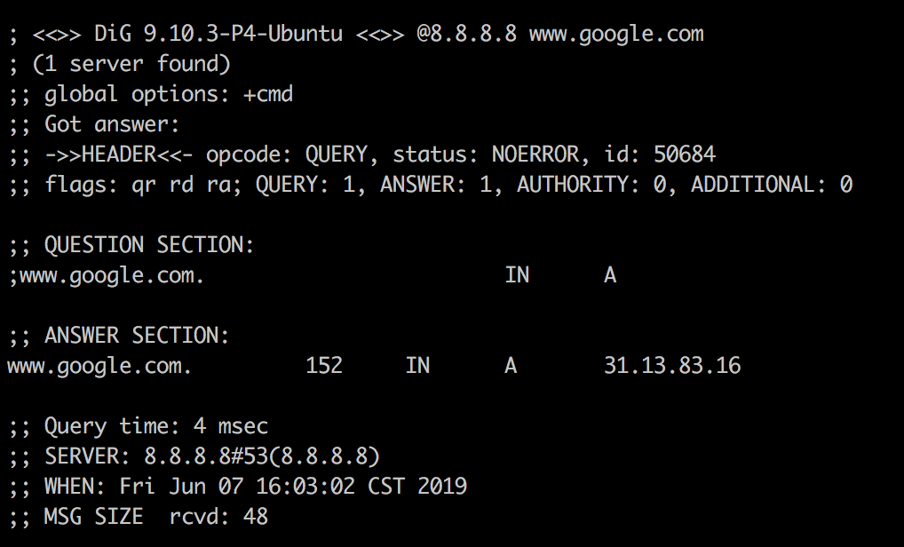

# DNS原理

## DNS服务器
DNS服务器IP地址两种设定:  
+ 每次上网时由网关动态分配，这叫做DHCP机制
+ 事先指定的固定地址, Linux系统存储在/etc/resolv.conf

有一些公网的DNS服务器，也可以使用，其中最有名的就是Google的8.8.8.8和Level 3的4.2.2.2  
本机只向自己的DNS服务器查询，dig命令有一个@参数，显示向其他DNS服务器查询的结果
```
$ dig @8.8.8.8 www.google.com
```


## 域名的层级
```
DNS服务器怎么会知道每个域名的IP地址呢？答案是分级查询。
个域名的尾部都多了一个点。

比如，域名math.stackexchange.com显示为math.stackexchange.com.。这不是疏忽，而是所有域名的尾部，实际上都有一个根域名。
举例来说，www.example.com真正的域名是www.example.com.root，简写为www.example.com.。因为，根域名.root对于所有域名都是一样的，所以平时是省略的。
根域名的下一级，叫做"顶级域名"（top-level domain，缩写为TLD），比如.com、.net；
再下一级叫做"次级域名"（second-level domain，缩写为SLD），比如www.example.com里面的.example，这一级域名是用户可以注册的；
再下一级是主机名（host），比如www.example.com里面的www，又称为"三级域名"，这是用户在自己的域里面为服务器分配的名称，是用户可以任意分配的。


主机名.次级域名.顶级域名.根域名
# 即
host.sld.tld.root
```

## 根域名服务器
```
DNS服务器根据域名的层级，进行分级查询。
需要明确的是，每一级域名都有自己的NS记录，NS记录指向该级域名的域名服务器。这些服务器知道下一级域名的各种记录。
所谓"分级查询"，就是从根域名开始，依次查询每一级域名的NS记录，直到查到最终的IP地址，过程大致如下。

从"根域名服务器"查到"顶级域名服务器"的NS记录和A记录（IP地址）
从"顶级域名服务器"查到"次级域名服务器"的NS记录和A记录（IP地址）
从"次级域名服务器"查出"主机名"的IP地址

仔细看上面的过程，你可能发现了，没有提到DNS服务器怎么知道"根域名服务器"的IP地址。回答是"根域名服务器"的NS记录和IP地址一般是不会变化的，所以内置在DNS服务器里面。

分级查询过程
$ dig +trace www.google.com

```

## 参考
+ http://www.ruanyifeng.com/blog/2016/06/dns.html
